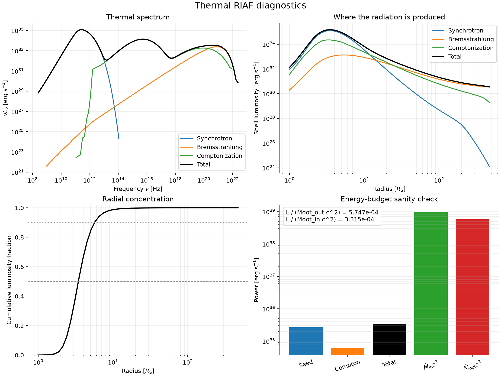

# Thermal RIAF pipeline

This repository joins the one-dimensional transonic RIAF solver in `RIAF/`
to the thermal radiation code in `radproc/`. A collaborator edits one TOML
file and runs one command; the pipeline finds the angular-momentum eigenvalue,
integrates through the sonic point, transfers the radial solution to the
previously compiled C++ program, and calculates synchrotron, bremsstrahlung,
and Compton emission.

## Requirements

- Python 3.11 or newer
- NumPy, SciPy, Astropy, and Matplotlib
- A C++17 compiler and CMake
- Boost, GSL, and OpenMP development files

On Ubuntu/Debian, install the native dependencies with:

```bash
sudo apt install build-essential cmake libboost-dev libgsl-dev
python3 -m venv .venv
source .venv/bin/activate
python -m pip install -r requirements.txt
./build.sh
```

CMake replaces only the native C++ build system. It does not replace Python:
the top-level pipeline is written in Python, and hydro-profile runs additionally
use the Python RIAF solver. Unlike Meson, however, CMake is installed here as a
native system package rather than through the Python environment. `build.sh`
is the one-time compilation step; rerun it only after changing C++ source code,
the compiler, or native libraries.

## Quick start

```bash
python riaf_pipeline.py examples/thermal-riaf.toml
```

The example writes hydrodynamic files under `runs/thermal-riaf/hydro/` and the
radiative results under `runs/thermal-riaf/spectrum/`. The final spectrum is
`lumThermal.dat`. It also creates `thermal-diagnostics.png`, containing the
separate emission components, radial luminosity, cumulative emission, and an
accretion-power sanity check. Machine-readable values are saved in
`diagnostics.json`. The compiled executable remains under `radproc/build/`.
Normal scientific runs do not invoke CMake. Required Compton probability tables
are copied into each run automatically.

The examples use four OpenMP threads. The Monte Carlo scattering calculation
uses an independent random-number generator for each radial source cell, seeded
from `radiation.scattering_random_seed`. Consequently, its result is reproducible
and independent of the OpenMP thread count. Set `run.omp_threads` to suit the
machine available to you.

To test only the Python solution and parameter handoff:

```bash
python riaf_pipeline.py examples/thermal-riaf.toml --hydro-only
```

All normal model choices are documented directly in the example TOML. Copy it,
change the physical parameters, and keep `profile.source = "hydro"`. Thermal
processes have explicit Boolean names; nonthermal calculations are always
disabled by this interface.

For definitions, units, defaults, and the contents of every generated parameter
file, see the [configuration reference](docs/configuration.md).

## Radial profiles from another code

Set `profile.source = "external"` to bypass the Python hydrodynamics and feed a
radial profile directly to `radproc`. The expected columns and units are in
[docs/external-profiles.md](docs/external-profiles.md).

The repository includes a complete external-profile example. After the one-time
`./build.sh` step, run:

```bash
python riaf_pipeline.py examples/external-profile.toml
```

This command validates the 2,553-point bundled profile and computes
synchrotron, bremsstrahlung, and thermal Comptonization, and writes its products
to `runs/external-profile/spectrum/`. A successful reference run gives a total
thermal luminosity of approximately `3.3e35 erg s^-1` and an outer radiative
efficiency of approximately `5.7e-4`. Small numerical differences can arise
after changing the physical or grid parameters.

The automatically generated diagnostic below shows the individual spectral
components, emission as a function of radius, cumulative radial luminosity, and
the accretion-energy check:



To regenerate only this figure from existing output:

```bash
python plot_diagnostics.py examples/external-profile.toml \
  --spectrum-dir runs/external-profile/spectrum
```

## Existing low-level interfaces

The historical scripts and full `radproc/src/adaf/parameters.json` interface
remain available for specialized projects. New thermal RIAF runs should use the
top-level pipeline because it validates the input, sets the thermal flags
consistently, and keeps generated files out of the source directories.

## Reproducibility and troubleshooting

- Each run retains the exact generated `hydro-input.json` and
  `parameters.json` beside its outputs.
- If the angular-momentum bracket does not straddle a smooth solution, adjust
  `hydro.log10j0` and `hydro.log10j1` in the TOML.
- Delete `radproc/build/` after changing compilers or system dependencies, then
  rerun `./build.sh`.
- Developers can use `python riaf_pipeline.py CONFIG --build` to rebuild and run
  in one command. Regular model runs use the existing executable and skip CMake.

Run the lightweight interface tests with `python -m unittest discover -s tests`.

To recreate a plot without rerunning either physical code:

```bash
python plot_diagnostics.py examples/thermal-riaf.toml
```
